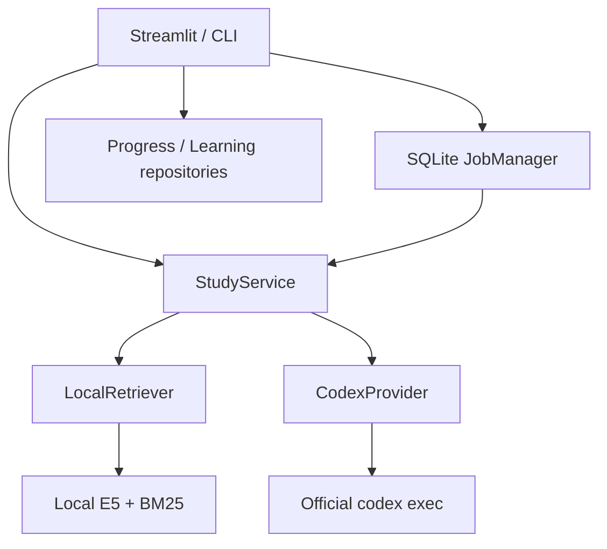

# Architecture

## Runtime boundaries

`src/service.py` owns typed `LearningRequest`/`LearningOptions`, input limits, context selection, task prompts, schemas and domain rules. `src/schemas.py` owns strict JSON Schema and result validation. UI does not import subprocess or any model API client. RAGCore/AITutor are compatibility facades over the Service and share retrieval; they no longer pass OpenAI clients or embed inside tutor methods. `main.py` also queues through the same Service/Provider and process lock.

`src/runtime.py` creates resources without invoking a model, logging in, loading local weights or indexing PDFs. Dashboard/history need only repositories; Library enumerates local material metadata. Retrieval/model loading happens on explicit index/search/learning actions. Diagnostics do not generate.

## Generation and privacy

The Provider uses a fixed executable path, model `gpt-6-astra` and effort `medium`, argv plus stdin, `shell=False`, ephemeral per-request workdir, `--json`, `--output-schema`, `--sandbox read-only`, `--ignore-user-config`, strict configuration and tool-disable settings. No user-supplied shell command or arbitrary flag exists in the UI. Environment allowlisting excludes API keys, endpoint overrides and proxies. Authentication and refresh belong to the CLI; no Python code reads tokens/auth JSON.

`read-only` alone is not a confidentiality boundary. The audited settings provide **tools=[]** in a synthetic localhost wire probe. The probe also tests AGENTS/config/skills/hooks with synthetic markers, without credentials. The installed CLI still reads global AGENTS, lacks the requested model in its catalog, and does not accept built-in-provider retry overrides; real generation is therefore blocked. The exact evidence and fail-closed conditions are in [CODEX_BOUNDARY](CODEX_BOUNDARY.md). This refactor does not claim successful live GPT-6 integration.

Prompts use a single serialized untrusted-data object for excerpts, answers and history. App-owned developer instructions explicitly forbid following embedded instructions. These instructions complement tool isolation; they do not establish semantic prompt-injection immunity. Fake-provider testing does not prove that a real model will always grade correctly.

Generation sees bounded excerpts (maximum 10 chunks, 10,000 characters total and 1,600 per chunk), at most 20 relevant history entries and 6,000 lecture characters. The whole serialized input must fit 48KB before Provider's 64KiB UTF-8 limit. No whole home/repo/material collection is a working root. Returned source IDs must be in the offered set; reference validity is not proof that every factual statement is supported.

Result Markdown uses safe Streamlit defaults. Simple Mermaid flowcharts are parsed to an allowlisted node/edge data structure and rendered with Graphviz. HTML, links, directives and unsupported diagrams are code text; generated code is never executed.

## Jobs, idempotency and cancellation

`JobManager` stores requests, states, results and sanitized errors in private SQLite. The lifecycle is queued → running → succeeded/failed/cancelled; recovered unfinished work becomes interrupted. The queue is process-local for callables and durable for state; restart never silently replays a request. Concurrency is one per shared state directory, including multiple server processes, enforced by an OS lock. The lock descriptor is inherited by the owned CLI child so a killed parent cannot release the slot prematurely. The worker polls cancellation and never manipulates Streamlit state.

`LearningRepository.claim_submission()` serializes pending check / job registration / pointer save for the same scope. The request digest contains subject, session, course, textbook revision, model/effort, prompt/schema versions, options and payload. Separate attempts and deliberate retries get new IDs. Reading a completed job does not generate again. Results persist with job receipt IDs; progress events independently deduplicate XP/weakness changes. A completed result for a different subject/session/course cannot be applied.

Provider drains stdout and stderr concurrently, enforces byte/time limits, rejects invalid/truncated JSONL and requires both a completed turn and final message. Intermediate reasoning/events are neither exposed to users nor stored as answers. Cancel/timeout terminates only its newly owned process group and reaps it. Cancelled results are discarded before job success. No automatic app retry consumes quota. Internal CLI retries remain an explicit unresolved boundary for this installed version.

A new material revision invalidates an in-flight result: Service compares revisions before/after retrieval and before/after generation, and UI checks again before application. A filesystem change in the tiny interval after the last check is still possible; there is no transaction spanning arbitrary external PDF edits and SQLite. Stored source IDs/versions preserve which snapshot was used. Course lecture updates patch the current chapter inside the progress transaction to avoid replacing another tab's whole curriculum.

Lecture writes compare the previous lecture ID inside that transaction, so an older job cannot overwrite another session's newer lecture. Course exams and grades carry app-owned chapter index and lecture ID. Chapter completion verifies the passed attempt against that exact chapter, current stored lecture and current material revision before granting 50 XP once. Results rejected after material/lecture changes can be explicitly discarded without being treated as successful learning.

## Repositories and retrieval

- `progress.sqlite3`: versioned progress document, lossless legacy migration, unknown fields, event ledger, migration provenance.
- `learning.sqlite3`: subject/session/course/chapter/view-scoped messages and results, atomic pending claim and result receipts.
- `jobs.sqlite3`: request lifecycle, validated results, request digest and metadata. Payload/result are private learning data; diagnostics return metadata only.

SQLite files are private, WAL-enabled, version checked, and protected against parallel initialization. Unknown future versions and corrupt files fail closed. The old `progress.json` remains unchanged. Secrets/materials/models/caches/databases are not committed.

Retriever owns safe category/subject paths, PDF extraction, stable material/chunk provenance, local E5 and Japanese-aware BM25, snapshot cache identity and shape validation. It never falls back to an embedding API. See [LOCAL_RETRIEVAL](LOCAL_RETRIEVAL.md).

Library versions are captured once per Retriever/Embedder instance, using an independent search-path snapshot for package discovery. This avoids false revision changes when Streamlit mutates `sys.path` during reruns. Restart the app after changing installed dependencies; do not mutate a running environment in place.
